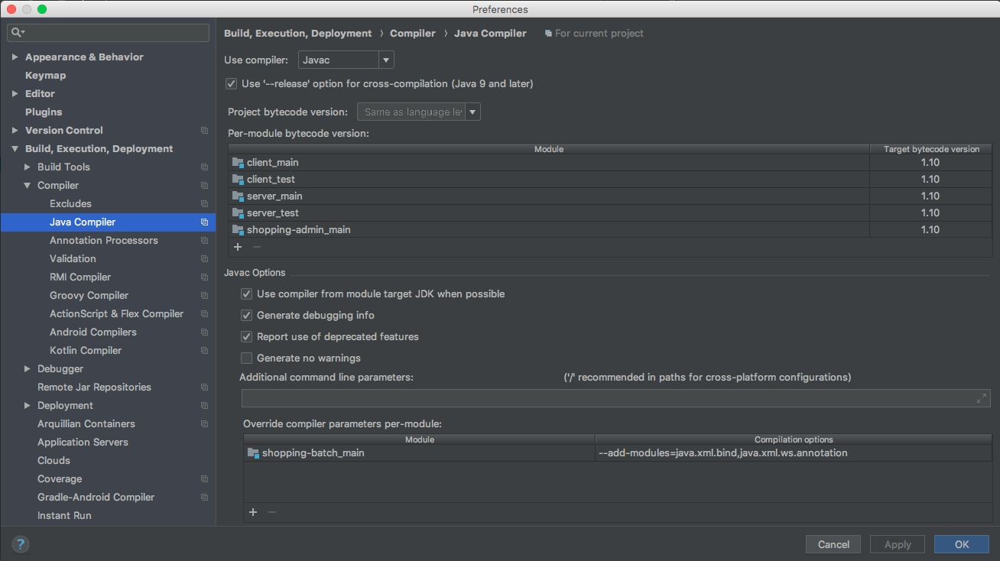
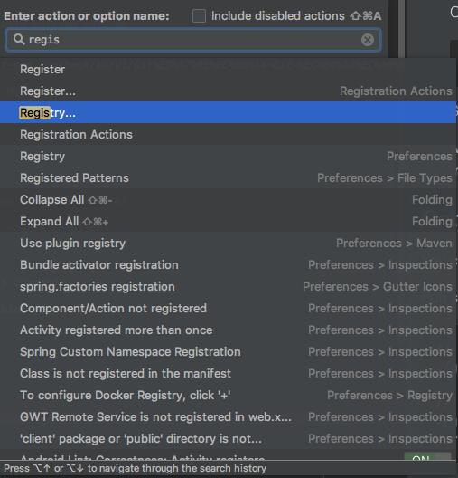
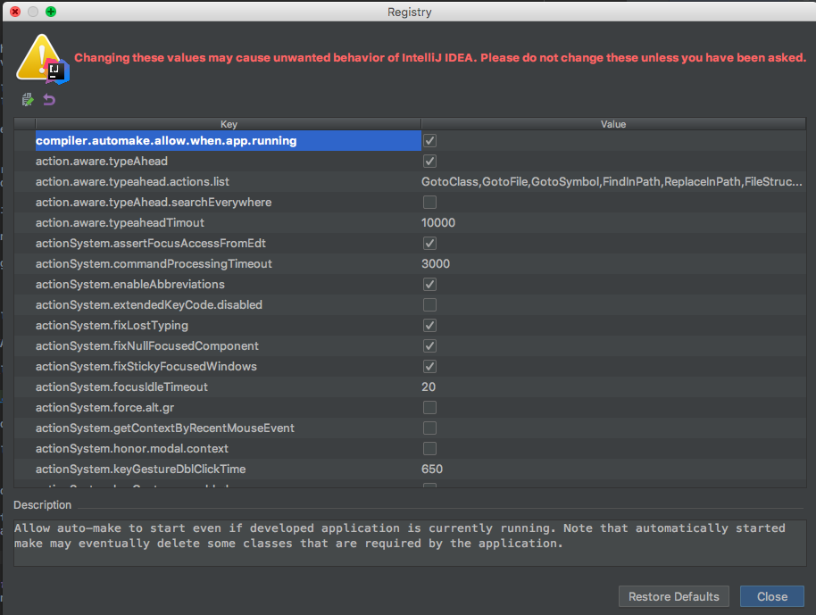
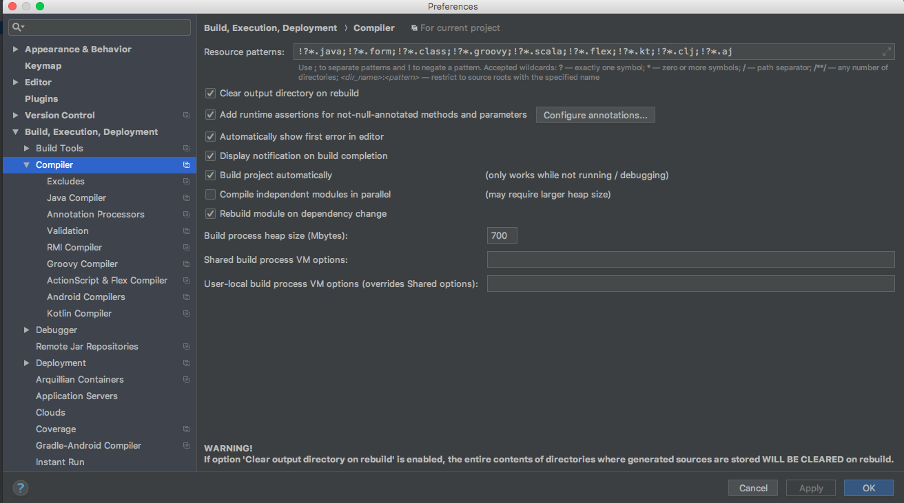

### Prerequisites
* Git
* JDK 12
* Node 8.9.0 or above
* Yarn 1.3.2 or above

### Configure Local Environments
- Install JDK 12 ([download](http://www.oracle.com/technetwork/java/javase/downloads/index.html))
- Install NVM

  The project manages the version of node through nvm.
  ```bash
  $ curl -o- https://raw.githubusercontent.com/creationix/nvm/v0.33.8/install.sh | bash
  $ command -v nvm
  nvm
  $ nvm install 8.9.0
  $ npm install -g yarn
  ```
  In the project root as follows are performed through the .nvmrc
  ```bash
  $ nvm use
  Found '/Users/user/Github/shopping-web/.nvmrc' with version <8.9.0>
  Now using node v8.9.0 (npm v5.5.1)
  ```
- Configure Git core.autocrlf ( [Link](https://git-scm.com/book/ko/v1/Git%EB%A7%9E%EC%B6%A4-Git-%EC%84%A4%EC%A0%95%ED%95%98%EA%B8%B0#%EC%86%8C%EC%8A%A4-%ED%8F%AC%EB%A7%B7%EA%B3%BC-%EA%B3%B5%EB%B0%B1) )
  
  To avoid line-ending issues between Windows and Mac.
  ```bash
  $ git config --global core.autocrlf input
  ```
  

- Set if developing with intelliJ 
 
   Due to JAVA language level, use IntelliJ version 2018.1.5 or later
   
  
### Getting Started
You can run on IDE or

Run shop-app
```bash
// server
./gradlew bootRun

// client (choose either one)
./gradlew yarnStart
yarn --cwd ./shop-app/client/ start:shopapp
```
 
  
### IDEA Setting
  - Install plugin : *Lombok*
    - [x] *Enable annotation processing* (Build, Execution, Deployment > Compiler > Annotation Processors)
  - Setting Code Style (Editor > Code Style)
    - intellij-java-google-style.xml
    - [Reference](https://google.github.io/styleguide/javaguide.html)
    
  - JAVA10 Dependency add   
    Build, Execution, Deployment > Compiler > Java Compiler 
                
       
       
       Override compiler parameter per-module add this command
       ```bash
       --add-modules=java.xml.ws.annotation,java.xml.bind java.xml.bind
       ```
   - Auto Restart Options Setting (dev-tools)
    
     Registry Setting > <br> 
          &nbsp;&nbsp;window : ctrl + shift + a <br>
          &nbsp;&nbsp;mac : command + shift + a
       
       
       
       check this option 
        
       
       
     Compiler Setting > 
       
       &nbsp;&nbsp;Execution, Deployment > Compiler 
       
       &nbsp;&nbsp;Check  `Build Project automatically`
          
       
       
    
### Built with
- Backend
  - spring framework 5
  - spring boot 2
  - gradle  
- Frontend 
  - react 16
  - npm, yarn
  - webpack
  - ant design - react ui framework
